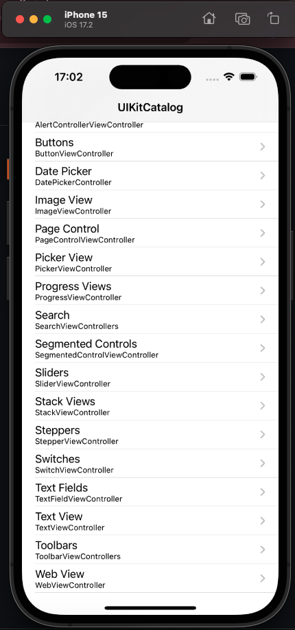

# Appium

2024 Juan M. Fonseca-Solís @ GorillaLogic.

## Description
Solution to exercises of Omprakash Chavan's course https://gorillalogic.udemy.com/course/the-complete-appium-course-for-ios-and-android.

## Requirements
* [Node.Js](https://nodejs.org/en) (required by Appium).
* Appium Server: `sudo npm install -g appium@next` (g stands for global).
* XCUITest driver: `sudo appium driver install xcuitest`.
* [Appium Inspector](https://github.com/appium/appium-inspector) (for inspecting the layout and build the locators).

## Simulator
* macOS 14.2 os later.
* [XCode 15.2](https://developer.apple.com/downloads/?name=Xcode).
* iOS 17.2 (install from XCode > Settings > Components).
* iOS udid: `xcrun simctl list | grep Booted`.

## Sample app for practicing automation
* [UIKitCatalog](https://github.com/appium/ios-uicatalog) 
    * Download the ZIP with the code. 
    * Run `cd UIKitCatalog; npm install`.
    * The app will be in the build/Release-iphonesimulator folder.



## Run
```
appium;
sudo appium driver install xcuitest;
```